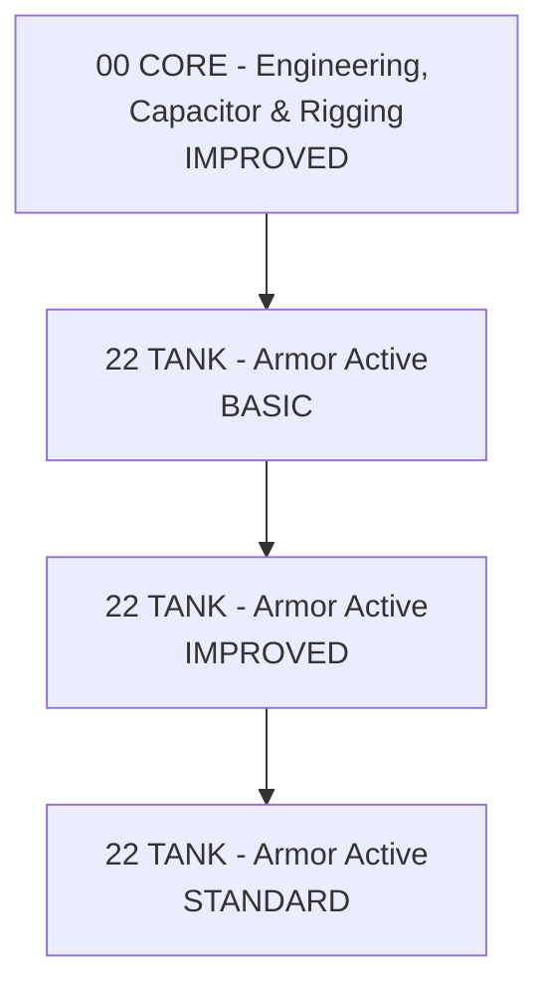

# Armor Active

🇵🇱 **Polski** | [🇬🇧 English](ARMOR_ACTIVE-EN.md)

```mermaid
flowchart TD
    A[00 CORE - Engineering, Capacitor & Rigging<br/>IMPROVED] --> B[22 TANK - Armor Active<br/>BASIC]
    B --> C[22 TANK - Armor Active<br/>IMPROVED]
    C --> D[22 TANK - Armor Active<br/>STANDARD]
```
