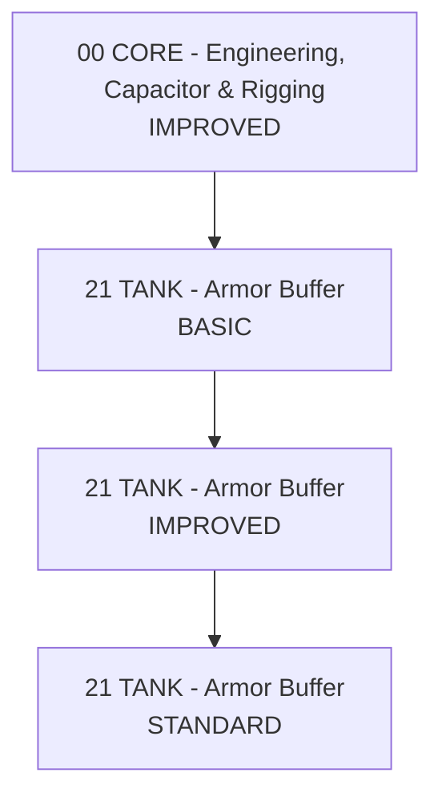

# Armor Buffer

[🇵🇱 Polski](ARMOR_BUFFER-PL.md) | 🇬🇧 **English**

## Interpretation

- `BASIC` = functional entry point with the armor foundation in place.
- `IMPROVED` = practical regular-use level.
- `STANDARD` = mature corp standard without automatically forcing every optional V.
