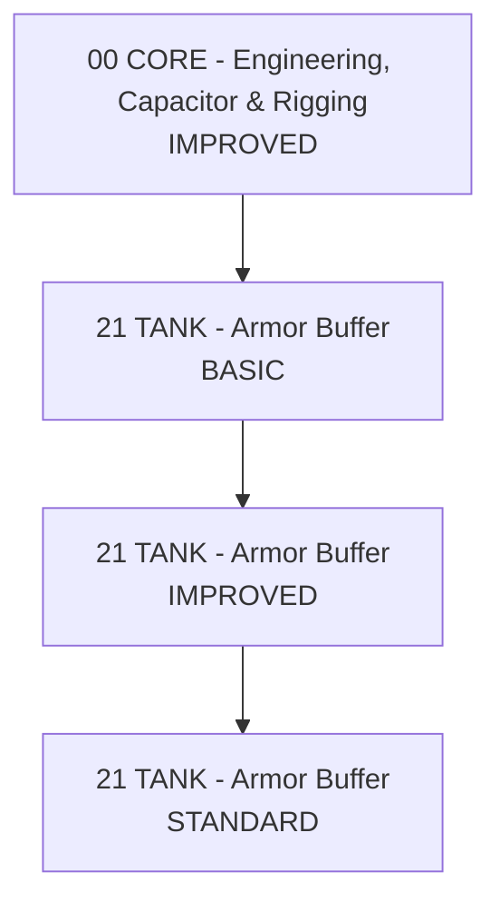

# Armor Buffer

🇵🇱 **Polski** | [🇬🇧 English](ARMOR_BUFFER-EN.md)

## Interpretacja

- `BASIC` = działa i ma pełną bazę armor.
- `IMPROVED` = normalny corp poziom.
- `STANDARD` = dalsze szlifowanie bez automatycznego wciskania wszystkich V.
