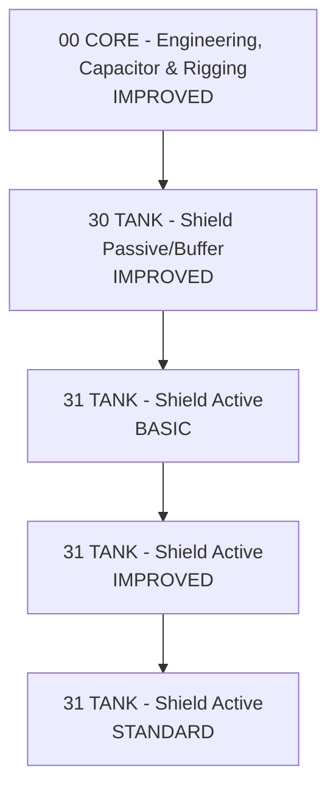

# Shield Active

[🇵🇱 Polski](SHIELD_ACTIVE-PL.md) | 🇬🇧 **English**

```mermaid
flowchart TD
    A[00 CORE - Engineering, Capacitor & Rigging<br/>IMPROVED] --> B[30 TANK - Shield Passive/Buffer<br/>IMPROVED]
    B --> C[31 TANK - Shield Active<br/>BASIC]
    C --> D[31 TANK - Shield Active<br/>IMPROVED]
    D --> E[31 TANK - Shield Active<br/>STANDARD]
```
