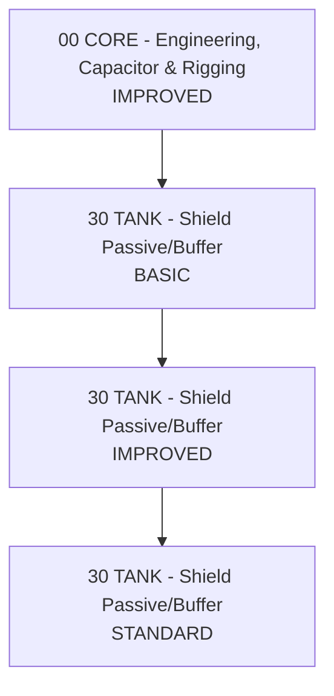

# Shield Buffer

🇵🇱 **Polski** | [🇬🇧 English](SHIELD_BUFFER-EN.md)

```mermaid
flowchart TD
    A[00 CORE - Engineering, Capacitor & Rigging<br/>IMPROVED] --> B[30 TANK - Shield Passive/Buffer<br/>BASIC]
    B --> C[30 TANK - Shield Passive/Buffer<br/>IMPROVED]
    C --> D[30 TANK - Shield Passive/Buffer<br/>STANDARD]
```
