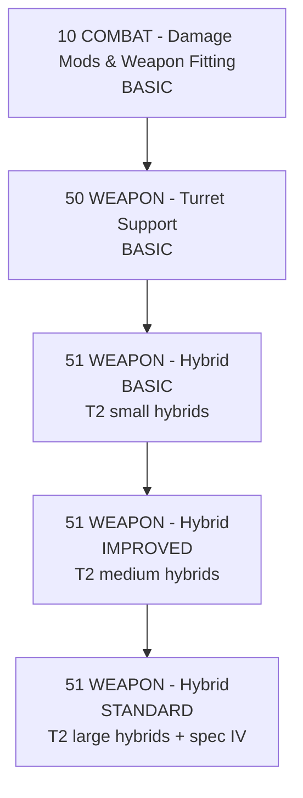

# Hybrid Weapons

[🇵🇱 Polski](HYBRID_WEAPONS-PL.md) | 🇬🇧 **English**

## What this means

- `BASIC` = small T2 blasters/railguns — frigate/destroyer.
- `IMPROVED` = medium T2 blasters/railguns — cruiser/BC.
- `STANDARD` = large T2 blasters/railguns — battleship.
