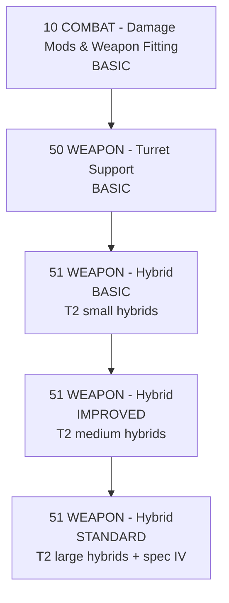

# Hybrid Weapons

🇵🇱 **Polski** | [🇬🇧 English](HYBRID_WEAPONS-EN.md)

## Co to oznacza

- `BASIC` = małe T2 blastery/raile — frigate/destroyer.
- `IMPROVED` = średnie T2 blastery/raile — cruiser/BC.
- `STANDARD` = duże T2 blastery/raile — battleship.
