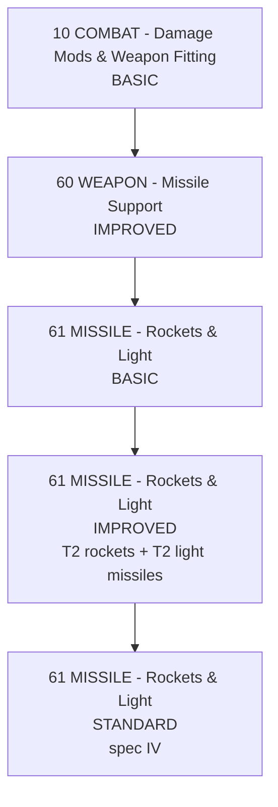

# Rockets Light Missiles

[🇵🇱 Polski](ROCKETS_LIGHT_MISSILES-PL.md) | 🇬🇧 **English**

```mermaid
flowchart TD
    A[10 COMBAT - Damage Mods & Weapon Fitting<br/>BASIC] --> B[60 WEAPON - Missile Support<br/>IMPROVED]
    B --> C[61 MISSILE - Rockets & Light<br/>BASIC]
    C --> D[61 MISSILE - Rockets & Light<br/>IMPROVED<br/>T2 rockets + T2 light missiles]
    D --> E[61 MISSILE - Rockets & Light<br/>STANDARD<br/>spec IV]
```
