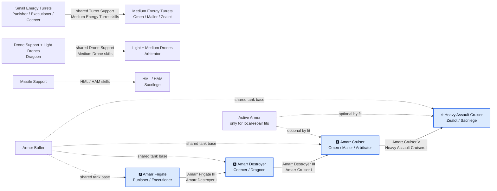

# Amarr progression diagram

[🇵🇱 Polski](DIAGRAM-PL.md) | 🇬🇧 **English**

The hull requirements are shared, but the tool paths are not. The laser investment carries from small hulls into Zealot, the drone branch ends as a main-weapon line at Arbitrator, and Sacrilege starts a separate missile branch at HAC level. Armor Buffer is the common tank base; Active Armor is added only for a fit with a local repairer.
