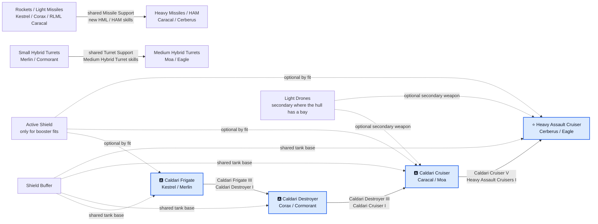

# Caldari progression diagram

[🇵🇱 Polski](DIAGRAM-PL.md) | 🇬🇧 **English**

Both weapon branches use the same Caldari hull requirements and shield foundation. Missile skills carry from Kestrel and Corax into Caracal and Cerberus; hybrid skills carry from Merlin and Cormorant into Moa and Eagle. Light drones are secondary and do not replace either main weapon branch.
