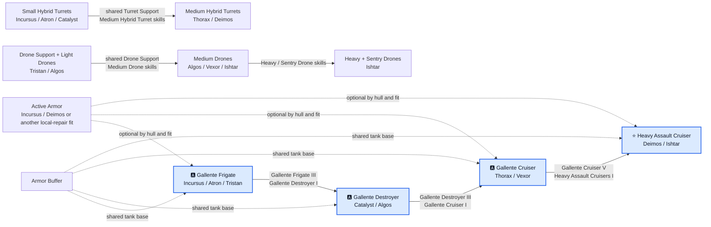

# Gallente progression diagram

[🇵🇱 Polski](DIAGRAM-PL.md) | 🇬🇧 **English**

Gallente hull requirements are shared, while the main-weapon investment splits cleanly. Hybrid skills carry from Incursus or Atron through Catalyst and Thorax to Deimos. Drone skills carry from Tristan through Algos and Vexor to Ishtar, where heavy and sentry drones become an additional specialization. Armor Buffer is the common base; Active Armor is fit-dependent.
