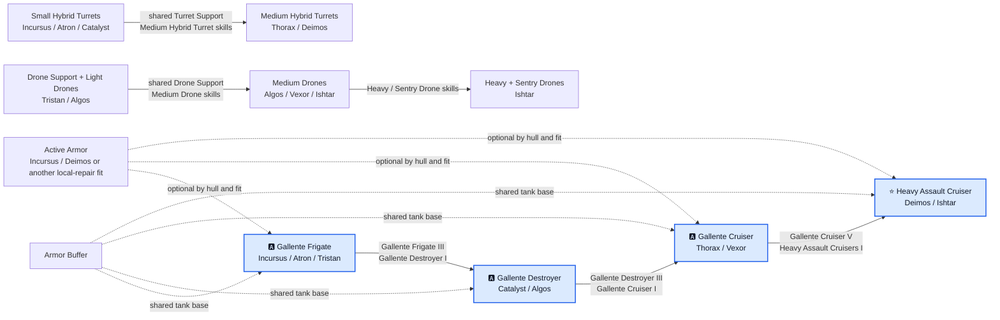

# Gallente — diagram progresji

🇵🇱 **Polski** | [🇬🇧 English](DIAGRAM-EN.md)

Wymagania hulli Gallente są wspólne, natomiast inwestycja w główną broń rozdziela się wyraźnie. Skille hybrid przechodzą z Incursusa albo Atrona przez Catalysta i Thoraxa do Deimosa. Skille dronowe przechodzą z Tristana przez Algosa i Vexora do Ishtara, gdzie heavy i sentry drones stają się dodatkową specjalizacją. Armor Buffer jest wspólną bazą; Active Armor zależy od hulla i fita.
