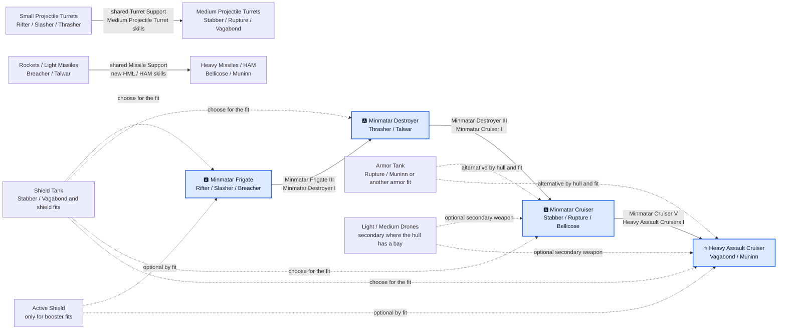

# Minmatar progression diagram

[🇵🇱 Polski](DIAGRAM-PL.md) | 🇬🇧 **English**

The two weapon branches reuse the same Minmatar hull requirements but not the same weapon skills. Projectile training carries into Vagabond, while missile training carries into the current Muninn. Tank is not racial shorthand: Stabber and Vagabond naturally use shield, while Rupture and Muninn may use shield or armor according to the actual fit. Drones remain secondary.
