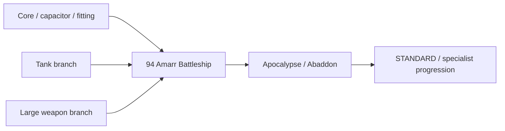

# Diagram

[🇵🇱 Polski](DIAGRAM-PL.md) | 🇬🇧 **English**

```mermaid
flowchart LR
    CORE[Core / capacitor / fitting] --> B[94 Amarr Battleship]
    T[Tank branch] --> B
    W[Large weapon branch] --> B
    B --> H[Apocalypse / Abaddon]
    H --> SPEC[STANDARD / specialist progression]
```
