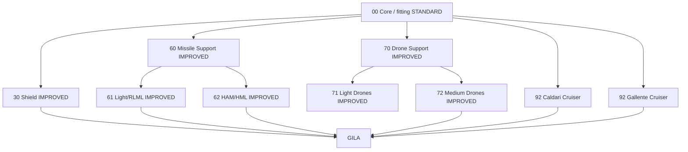

# Gila — diagram

🇵🇱 **Polski** | [🇬🇧 English](DIAGRAM-EN.md)

```mermaid
flowchart TD
    A[00 Core / fitting STANDARD] --> B[30 Shield IMPROVED]
    A --> M[60 Missile Support IMPROVED]
    A --> D[70 Drone Support IMPROVED]
    M --> M1[61 Light/RLML IMPROVED]
    M --> M2[62 HAM/HML IMPROVED]
    D --> D1[71 Light Drones IMPROVED]
    D --> D2[72 Medium Drones IMPROVED]
    A --> C[92 Caldari Cruiser]
    A --> G[92 Gallente Cruiser]
    B --> X[GILA]
    M1 --> X
    M2 --> X
    D2 --> X
    C --> X
    G --> X
```
