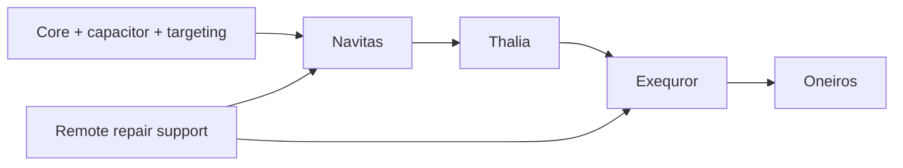

# Diagram

🇵🇱 **Polski** | [🇬🇧 English](DIAGRAM-EN.md)

```mermaid
flowchart LR
    CORE[Core + capacitor + targeting] --> F1[Navitas]
    F1 --> F2[Thalia]
    F2 --> C1[Exequror]
    C1 --> C2[Oneiros]
    REP[Remote repair support] --> F1
    REP --> C1
```
