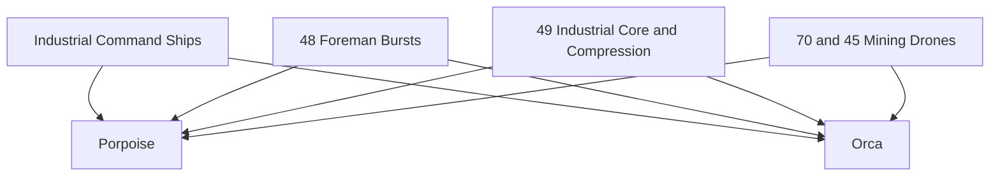

# Mining Command — diagram

[🇵🇱 Polski](DIAGRAM-PL.md) | 🇬🇧 **English**

```mermaid
flowchart TD
    H["Industrial Command Ships"]
    P["Porpoise"]
    O["Orca"]
    B["48 Foreman Bursts"]
    C["49 Industrial Core and Compression"]
    D["70 and 45 Mining Drones"]

    H --> P
    H --> O
    B --> P
    B --> O
    C --> P
    C --> O
    D --> P
    D --> O
```
