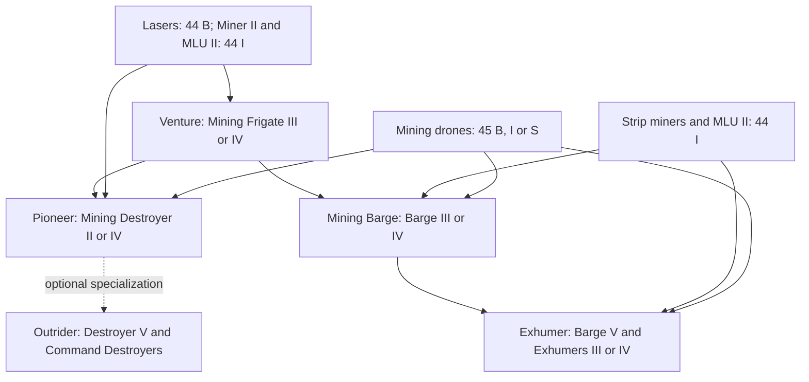

# Mining — diagram

[🇵🇱 Polski](DIAGRAM-PL.md) | 🇬🇧 **English**

`44 B` is sufficient to enter T1 mining. `44 I` is the regular threshold: it provides Miner II, Modulated Strip Miner II and Mining Laser Upgrade II. Module `45` develops mining drones independently of the chosen hull branch. Gas uses `46`, ice uses `47`, and the Outrider additionally uses `48` for foreman bursts. Porpoise and Orca are covered in the separate [Mining Command Training Path](../mining-command/README-EN.md).
