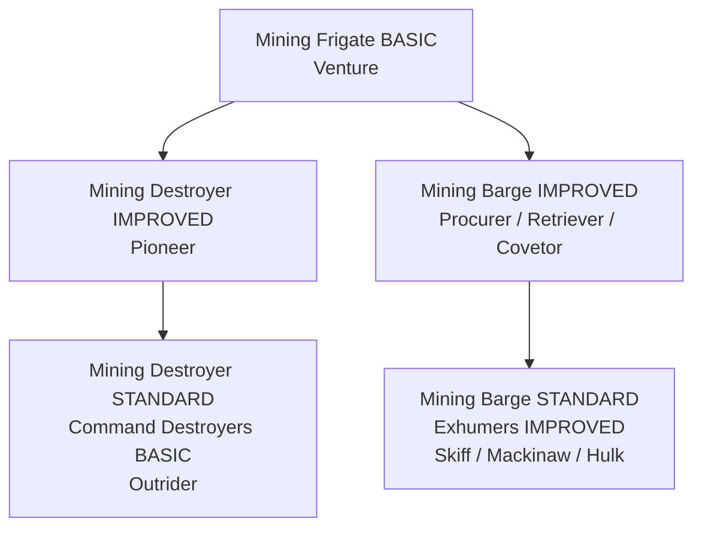

# Mining — diagram

[🇵🇱 Polski](DIAGRAM-PL.md) | 🇬🇧 **English**

```mermaid
flowchart TD
    V[Mining Frigate BASIC<br/>Venture]
    P[Mining Destroyer IMPROVED<br/>Pioneer]
    O[Mining Destroyer STANDARD<br/>Command Destroyers BASIC<br/>Outrider]
    B[Mining Barge IMPROVED<br/>Procurer / Retriever / Covetor]
    E[Mining Barge STANDARD<br/>Exhumers IMPROVED<br/>Skiff / Mackinaw / Hulk]

    V --> P
    P --> O
    V --> B
    B --> E
```

Porpoise and Orca are covered in the separate [Mining Command Training Path](../mining-command/README-EN.md).
