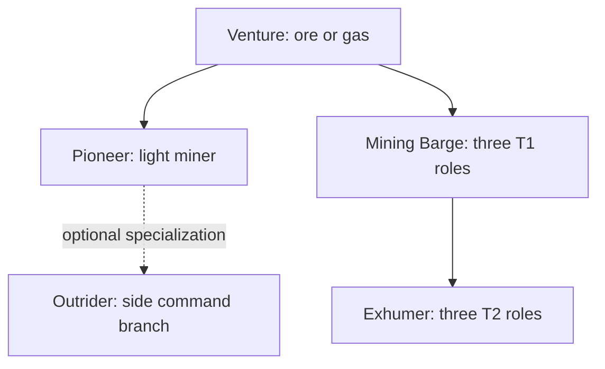

# Mining — diagram

[🇵🇱 Polski](DIAGRAM-PL.md) | 🇬🇧 **English**

Tool modules select the activity: 44 lasers and upgrades, 45 mining drones, 46 gas, 47 ice and 48 foreman bursts. Porpoise and Orca are covered in the separate [Mining Command Training Path](../mining-command/README-EN.md).
