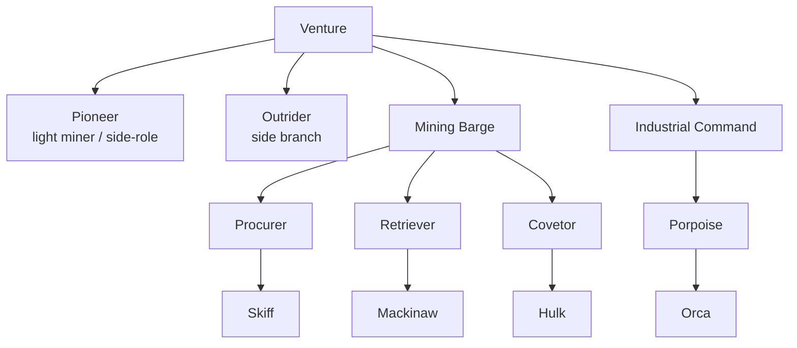

# Mining — diagram

[🇵🇱 Polski](DIAGRAM-PL.md) | 🇬🇧 **English**

```mermaid
flowchart TD
    V[Venture] --> P[Pioneer
light miner / side-role]
    V --> O[Outrider
side branch]
    V --> B[Mining Barge]
    B --> PR[Procurer] --> SK[Skiff]
    B --> RE[Retriever] --> MA[Mackinaw]
    B --> CO[Covetor] --> HU[Hulk]
    V --> IC[Industrial Command]
    IC --> PO[Porpoise] --> OR[Orca]
```
