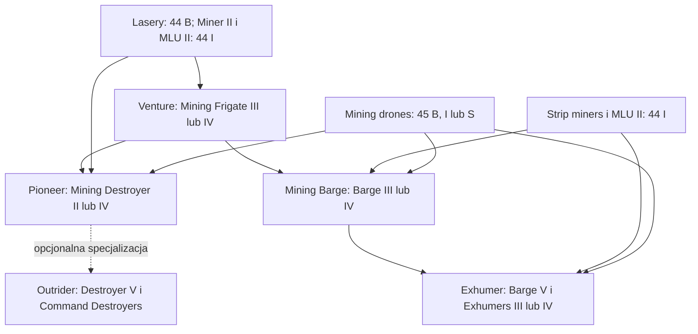

# Mining — diagram

🇵🇱 **Polski** | [🇬🇧 English](DIAGRAM-EN.md)

`44 B` wystarcza do wejścia w mining T1. `44 I` jest regularnym progiem: daje Miner II, Modulated Strip Miner II oraz Mining Laser Upgrade II. Moduł `45` rozwija mining drones niezależnie od wybranej gałęzi hulli. Dla gazu używany jest `46`, dla lodu `47`, a Outrider korzysta dodatkowo z `48` do foreman bursts. Porpoise i Orca są opisane w osobnej [ścieżce Mining Command](../mining-command/README-PL.md).
