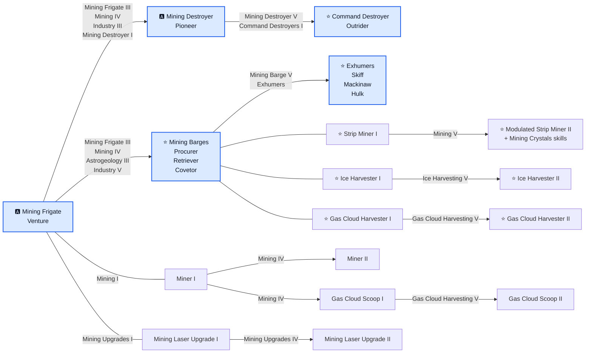

# Mining — diagram progresji

🇵🇱 **Polski** | [🇬🇧 English](DIAGRAM-EN.md)

Niebieskie węzły przedstawiają progresję hulli. Połączenia między nimi zawierają skille odblokowujące kolejny statek. Pozostałe węzły pokazują oddzielną progresję narzędzi: małe hulle rozwijają Miner, Gas Cloud Scoop i Mining Laser Upgrade, natomiast Mining Barges oraz Exhumers korzystają z osobnych rodzin strip minerów, ice harvesterów i gas cloud harvesterów.
