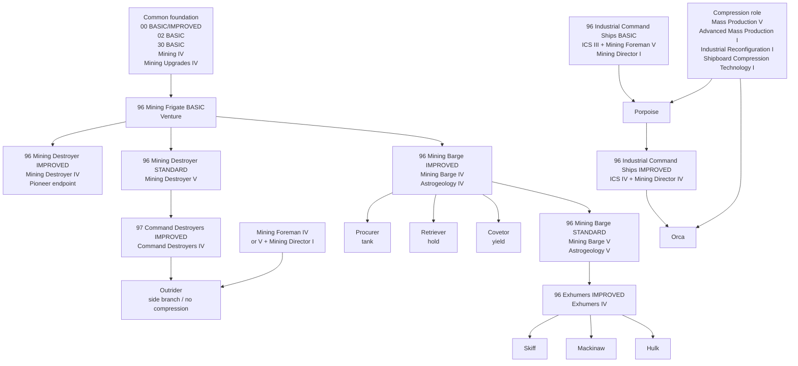

# Mining — diagram

🇵🇱 **Polski** | [🇬🇧 English](DIAGRAM-EN.md)

```mermaid
flowchart TD
    C[Common foundation
00 BASIC/IMPROVED
02 BASIC
30 BASIC
Mining IV
Mining Upgrades IV] --> V[96 Mining Frigate BASIC
Venture]

    V --> P[96 Mining Destroyer IMPROVED
Mining Destroyer IV
Pioneer endpoint]

    V --> OS[96 Mining Destroyer STANDARD
Mining Destroyer V]
    OS --> CD[97 Command Destroyers IMPROVED
Command Destroyers IV]
    CD --> O[Outrider
side branch / no compression]
    MF[Mining Foreman IV
or V + Mining Director I] --> O

    V --> B[96 Mining Barge IMPROVED
Mining Barge IV
Astrogeology IV]
    B --> PR[Procurer
tank]
    B --> RE[Retriever
hold]
    B --> CO[Covetor
yield]

    B --> BV[96 Mining Barge STANDARD
Mining Barge V
Astrogeology V]
    BV --> EX[96 Exhumers IMPROVED
Exhumers IV]
    EX --> SK[Skiff]
    EX --> MA[Mackinaw]
    EX --> HU[Hulk]

    IC[96 Industrial Command Ships BASIC
ICS III + Mining Foreman V
Mining Director I] --> PO[Porpoise]
    PO --> ICI[96 Industrial Command Ships IMPROVED
ICS IV + Mining Director IV]
    ICI --> OR[Orca]

    COMP[Compression role
Mass Production V
Advanced Mass Production I
Industrial Reconfiguration I
Shipboard Compression Technology I] --> PO
    COMP --> OR
```
