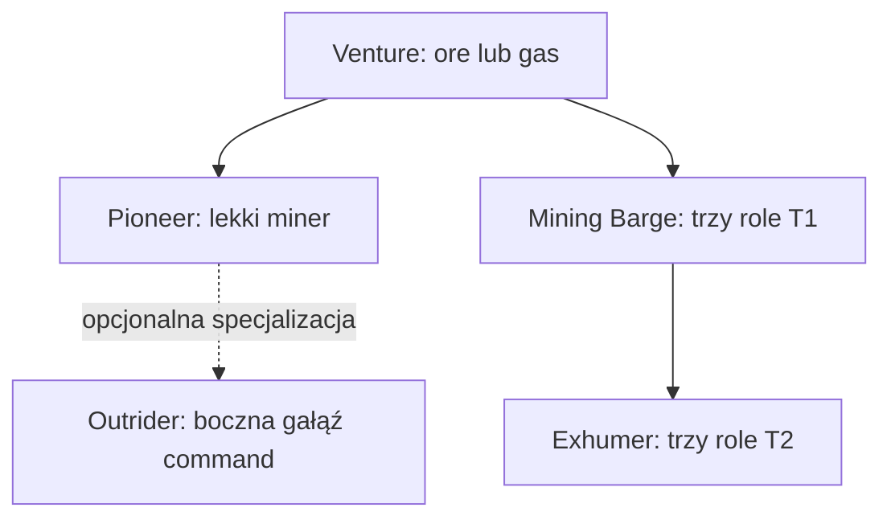

# Mining — diagram

🇵🇱 **Polski** | [🇬🇧 English](DIAGRAM-EN.md)

Moduły narzędzi wybierają aktywność: 44 lasers i upgrades, 45 mining drones, 46 gas, 47 ice oraz 48 foreman bursts. Porpoise i Orca są opisane w osobnej [ścieżce Mining Command](../mining-command/README-PL.md).
